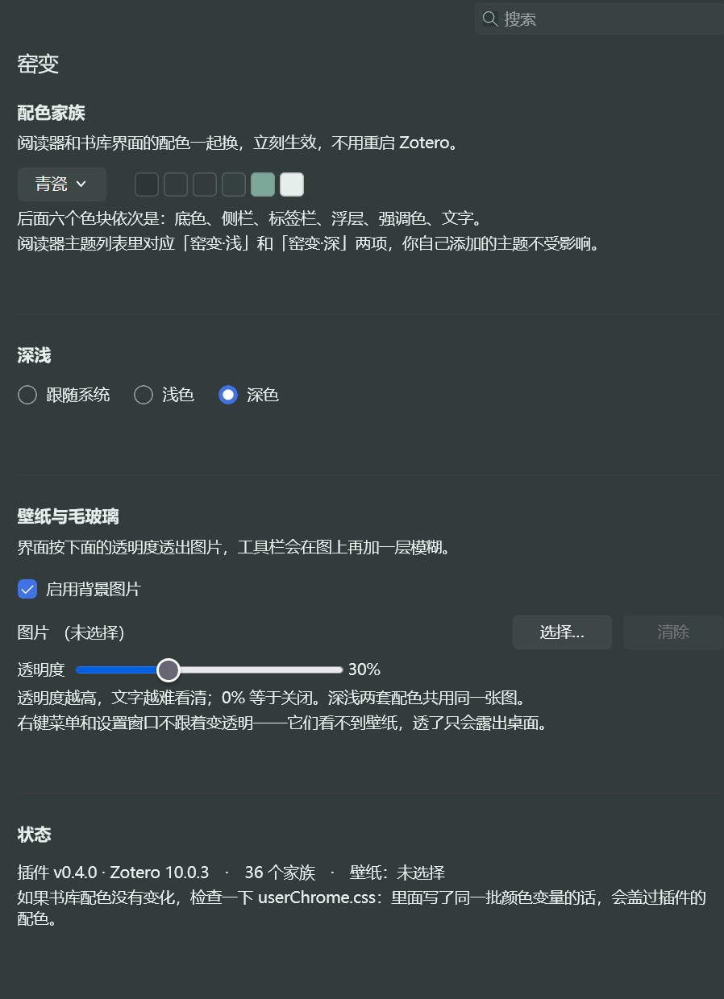

# 窑变 for Zotero

<p align="center">
  
</p>

<p align="center">
  <a href="https://github.com/Sum-su/yaobian-zotero/releases"></a>
  <a href="LICENSE"></a>
  
</p>

<p align="center">
  给 Zotero 的 36 套配色家族主题<br>
  阅读器和书库界面一起换色，支持深浅切换、背景图片与毛玻璃
</p>

---

## 安装

1. 到 [Releases](https://github.com/Sum-su/yaobian-zotero/releases/latest) 下载 `yaobian.xpi`。
2. Zotero → **工具 → 插件** → 右上角齿轮 → **Install Plugin From File…** → 选中刚下载的文件。
3. 按提示重启 Zotero。

之后插件会自己检查更新（依据本仓库的 [`updates.json`](updates.json)），不用再手动下载。需要 Zotero 7.0 或更高。

## 使用

面板有两个入口，改哪个都一样，两边会立刻同步：

- **设置 → 窑变** — 完整面板，带色板预览和壁纸路径。
- **工具 → 窑变** — 同样的控制项做成菜单，设置窗口没开着的时候用。

| 控制项 | 作用 |
|---|---|
| **配色家族** | 从 36 套里挑一套。阅读器的底色和书库界面的侧栏、标签栏、工具栏、菜单会一起换。调色板下面六个色块是当前这套的取色，鼠标悬停显示各自的色值。 |
| **深浅** | 跟随系统 / 浅色 / 深色。写的是 Zotero 自己的外观设置（和 **设置 → 外观** 是同一个开关），阅读器也跟着变。 |
| **壁纸与毛玻璃** | 启用后，界面按你设的透明度透出所选的图片，工具栏在图上再叠一层模糊。0% 等于关闭。 |

**所有改动都是热生效的**——换家族、切深浅、拖透明度，都不用重启 Zotero，已经打开的阅读器也会当场跟着变。

### 关于壁纸

透明度一个滑块同时控制两件事：界面整体的透明程度，和工具栏上那层模糊的强度（30% 对应 4px）。数值越高图越清楚，但文字也越难读。

深浅两套配色共用同一张图。图片只在**主窗口**里显示——右键菜单和设置窗口是独立的窗口，看不到主窗口后面的壁纸，让它们透明只会露出桌面，所以它们保持不透明。

## 配色家族

36 套，从 [窑变 for VS Code](https://github.com/Sum-su/yaobian-theme) 的同一套调色板投影过来，所以两边可以配成一致的样子。默认是**青瓷**。

禅棕、长安、春梅、Claude、丹霞、Dopamine、Dracula、歌蕾蒂娅·返航、汉白玉、湖光、金镶玉、流云、Mint、莫奈、暮山紫、奶茶、Peppa、琵琶、Pulse、**青瓷**、青花、青雾、汝窑蓝、汝窑绿、山水、素宣、天水、Vitesse Soft、宣纸、雁灰、烟雨、胭脂、羊皮纸、窑火、玉石、紫陶。

这 36 套色板**几乎都不是原创**：它们来自 cherrycss 收录的社区主题（其中大部分出自 linux.do 的中国风主题帖），以及 Dracula、Vitesse Soft 等各自的作者。逐条署名和许可声明见 [NOTICE.md](NOTICE.md)。

每一套都同时有浅色和深色两个版本，在面板的**深浅**里切换。

## 它不碰什么

- **你自己在阅读器里加的主题。** 插件只改写两个固定 id（`custom-yaobian-light` / `custom-yaobian-dark`）的条目，其余原样保留。
- **`userContent.css`。** 阅读器、pdf.js、笔记编辑器的自定义样式照常生效。
- **Windows 的窗口材质（Mica）。** 那是系统层面的东西，插件不介入；原因写在 [NOTICE.md](NOTICE.md)。

## 常见问题

**书库界面没变色，但阅读器变了。**

先看有没有 `userChrome.css`。Gecko 里 user 层的 `!important` 无条件压过 author 层，所以 `userChrome.css` 只要写了同一批颜色变量，插件的样式表就等于失效。把里面重复的配色部分删掉即可，删完立刻生效。这条提示在面板底部也会显示。

**右键菜单和设置窗口为什么不变透明？**

它们看不到壁纸。`backdrop-filter` 只能采样同一个窗口里的内容，而菜单和设置窗口是各自独立的顶层窗口，主窗口的壁纸对它们不可见。做成半透明只会露出桌面——比不透明更难看。设置窗口本身是跟着配色家族走的，只是不跟透明度。

**阅读器主题列表里多了「窑变·浅」和「窑变·深」两项。**

那是插件的两个槽位，名字会跟着你选的家族走（比如选青瓷就是「青瓷·浅」/「青瓷·深」）。Zotero 的阅读器主题接口没有目录，每加一套主题都会在那个小弹窗里多占一格，36 套 × 2 会排成 24 行。所以插件常驻两个槽位、按需改写它们，完整的 36 套放在工具菜单里。

**换机器 / 重装 Zotero 后配色还在吗？**

阅读器那两套主题存在 Zotero 的同步设置里，会跟着你的 Zotero 账号走。插件本身的偏好（家族、壁纸路径）是本地的，壁纸路径指向本地文件，换机器后要重新选图。

## 构建

```bash
python build.py
```

会先用 `src/gen_themes.py` 重新生成 `src/themes.js`，再把 `src/` 打成 `yaobian.xpi`。产物在旁边，安装方式同上。

开发笔记（Zotero 偏好面板的加载细节、第二个 chrome 窗口、XUL 的各种坑）在 **[docs/internals.md](docs/internals.md)**。

### 文件

| 路径 | 说明 |
|---|---|
| `src/bootstrap.js` | 插件主体：菜单、面板控制器、配色应用、样式表注入、壁纸 |
| `src/themes.js` | 36 套家族的色值，由 `gen_themes.py` 生成，不要手改 |
| `src/prefs.xhtml` | **设置 → 窑变** 面板（XHTML 片段，不是完整文档） |
| `src/prefs.js` | `extensions.yaobian.*` 的默认值 |
| `src/manifest.json` | 插件清单，含 `update_url` |
| `src/gen_themes.py` | 从 VS Code 版的主题文件生成 `themes.js` |
| `src/gen_icons.py` | 从源图重新生成图标（不参与 `build.py`） |
| `updates.json` | Zotero 拉取的更新清单，仓库根目录，**不打包进 xpi** |
| `build.py` | 构建脚本 |

`updates.json` 是清单里 `update_url` 指向的文件。它由手工维护、位于 `src/` 之外，所以 `build.py` 不会把它打进 xpi，改它也不会影响它自己声明的 `update_hash`。每次发版要同步更新其中的 `update_link` 和 `update_hash`。

## 许可

[MIT](LICENSE)。第三方素材的出处见 [NOTICE.md](NOTICE.md)，贡献者见 [CONTRIBUTORS.md](CONTRIBUTORS.md)。
